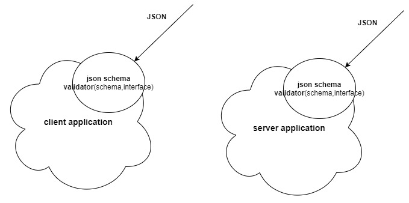

<h2>Motivation</h2>
Experiment with typescript-json-schema to create a JSON schema. JSON schema validator like ajv uses JSON schema to dynamically type check \ validate an interface-based js object in the following use cases

<ul>
<li>a request object in an express server</li>
<li>a complex object from the server, e.g., quiz object in react app</li>
 <li>a quiz object in a test of react app</li>
</ul> 

<p>You may claim that you get JSON from the server and trust the server; thus, there is no need to dynamic validate JSON on the client. However, you should expect many bugs during development, and a bug can be the wrong JSON from the server. Therefore, if you do not validate the JSON on the app boundaries, you will get an error way downstream, and there it will take you much more effort in debugging.
</p>

<h2>High level Overview</h2>
The result of the validator is boolean: valid or not and excellent error object in case not valid
 



<h2>Benefits of dynamic type checking using json-schema</h2>

<li>JSON is popular both flowing into the server and the client, thus using this approach can benefit you in many programming use cases
</li>

<li> Dynamic type checking is a _generic_ approach for validation with almost zero effort from the developer. Using this approach, you can validate anytime you get a JSON from outside of your application boundaries
</li>

<li>There is one source of truth for an object in terms of properties and constraints - it is the interface</li>

<li>json-schema have attributes like @maximum, @minimum, which you simply add to the interface. typescript-json-schema
pass these attributes under the hood to the JSON schema 
</li>

<li>it is possible to have nested interface like IPet in IPerson and json-schema support this fully</li>
<li>json-schema can be used in other programming languages with matching validators <a href='https://json-schema.org/implementations.html'>here</a></li>

<li>Most front-end developers omit dynamic type validation. So when a wrong JSON enters the client app boundaries, it's the server's fault. But now, using this effortless approach, the developer can implement dynamic type checks much more often.
</li>
<li>Performing dynamic type checks on JSON entering the application boundaries will increase the quality of your application.</li>
<li>One can implement dynamic type check using json-schema on both client-side and server-side
</li>

<h2>Installation</h2>

```
npm i
```

<h2>Usage</h2>
<ul>

<li>
Create an interface for an object to be validated.

IPerson: we also have @maximum @minimum annotation. Notice nested interfaces


```ts
interface IPet {
    name: string;
    /**
     * @minimum 1
     * @maximum 100
     */
    legs: number;
  }
  
  interface IPerson {
    name: string;
    age?: number;
    pets: IPet[];
  }
```

IQuizFromServer : complex interface including nesting

```ts
interface IQuizFromServer {
  _id : string;
  head : IQuizHead;
  items: IQuizItemFromServer[];
}

```

</li>

<li>
Create a schema per relevant interface

```
npx typescript-json-schema .\src\interfaces\IPerson.ts IPerson --out .\src\schemas\IPerson.schema.json
npx typescript-json-schema .\src\interfaces\IQuizFromServer.ts IQuizFromServer --out .\src\schemas\IQuizFromServer.schema.json
```

put each schema in schemas.ts file
</li>
<li>
validate object using a schema

```ts
// --- todo nath obj should be interface
function validate(schema: object, obj: any): void {
  const valid = ajv.validate(schema, obj);
  if (valid) {
    app.innerHTML += "<p>valid</p>";
  } else {
    app.innerHTML += "<p>not valid , check errors in the console</p>";
    console.log(ajv.errors);
  }
}
```

</li>

</ul>


<h2>Limitations</h2>
<ul>
<li>Creating a JSON schema and putting the schema _object_ in the schema file is currently manual.</li>
</ul>

<h2>Todo</h2>
Manually creating schema can cause a risk of sync problems between the interface and the schema. The sync risk is removed by doing this automatically. 
<p>How to do it</p>
<ul>
<li>Create a node application that uses typescript-json-schema via command line or API. The result is the creation of the schema and matching validator function.</li>
<li>Invoke this node application before: dev, build, start script, ideally only in case of a change in the interface file</li>
</ul> 

BTW, a validator is created in this <a href='https://www.npmjs.com/package/typescript-json-validator'>package</a> but not clear how. Check <a href='https://github.com/NathanKr/typescript-json-validator-playground'>my repo</a> 


<h2>Open issues</h2>
<ul>
<li>It is unclear how the annotation @minimum @maximum is passing to the json-schema. Sure, typescript-json-schema does it, but how 
</li>
</ul>